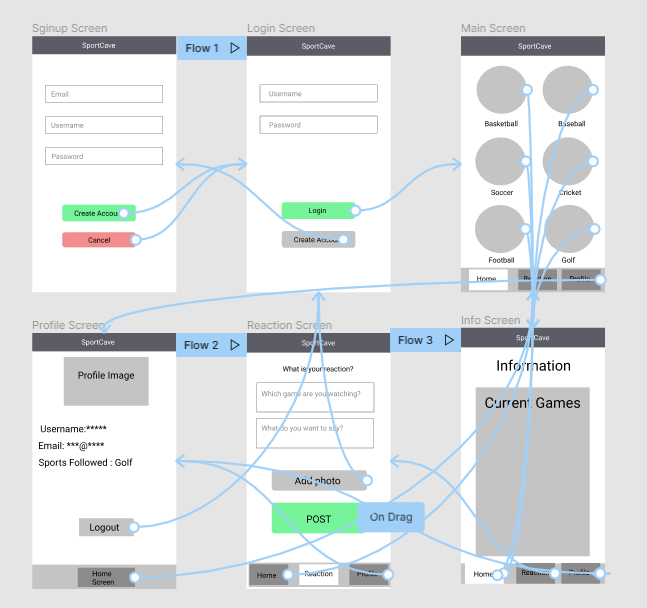
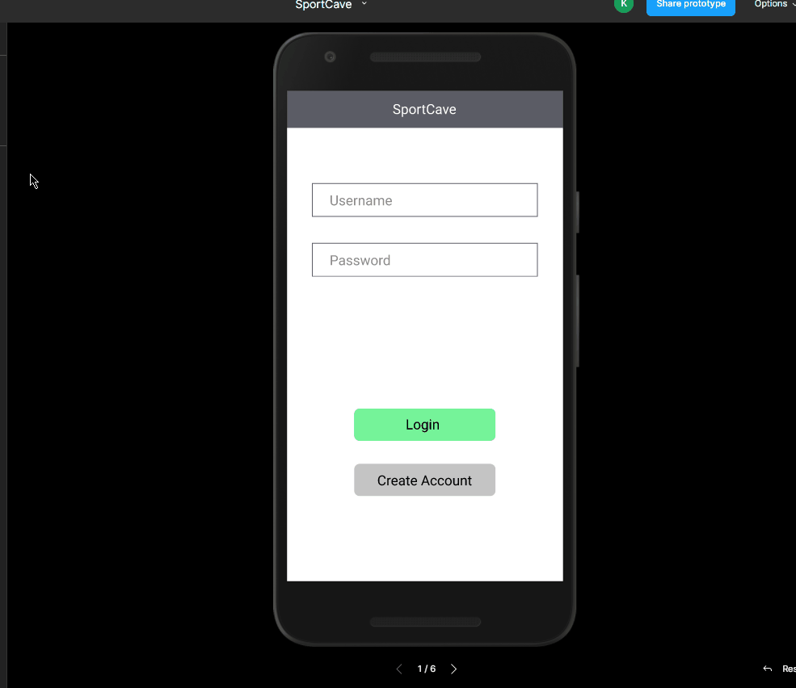

Original App Design Project - README Template
===

# SPORTCAVE

## Table of Contents
1. [Overview](#Overview)
1. [Product Spec](#Product-Spec)
1. [Wireframes](#Wireframes)
2. [Schema](#Schema)

## Overview
### Description
Browse sports categories to view scoring updates for domestic and international games. Connect with other sports fans.

### App Evaluation
[Evaluation of your app across the following attributes]
- **Category:** Sports / Social
- **Mobile:** Easier to check for updates, pull to refresh for real-time data, use camera to post photos to reactions feed and update profile photo.
- **Story:** Allows users to view scoring updates and access livestream links for different sports in one location rather than scouring the Internet every time. Connect with fellow sports fans by sharing reactions.
- **Market:** Any sports fan would enjoy this app.
- **Habit:**  Users can check back as often as they'd like and pull to refresh for updates.
- **Scope:** Initial features are to view scoring updates and to share reactions with other fans. App can be expanded to include livestreaming links.

## Product Spec

### 1. User Stories (Required and Optional)

**Required Must-have Stories**

* User must create an account in order to get into the app
* User can log in if they already have an account
* User should be able to logout
* User can select their favourite sports from the list of sports
* User can select different sports to view the game scores
* User can change pages, from Stream, to Profile, to Details

**Optional Nice-to-have Stories**

* User should click on a link to watch the game on the game's website
* User should be able update their profile

### 2. Screen Archetypes

* Login
   * User can log in if they already have an account
   * User should click on "Sign Up" button to create an account

* Register
   * User must create an account in order to get into the app
   
* Profile
   * User should be able update their profile information and logout
   
* Stream
   * User can select their favourite sports from the list of sports

* Stream Page 2
    * User can post their reaction of the game

* Details
   * User can select different sports to view the game scores
   * User should click on a link to watch the game on the game's website

### 3. Navigation

**Tab Navigation** (Tab to Screen)

* Stream
* Details
* Profile

**Flow Navigation** (Screen to Screen)

* Login
  * Stream
* Register
  * Stream 
* Profile
  * Details Page 2
* Stream
  * Detail
* Details
  * Stream

## Wireframes
[Add picture of your hand sketched wireframes in this section]

Image URL : https://imgur.com/a/mM8O8yB

### [BONUS] Digital Wireframes & Mockups
URL: https://www.figma.com/file/9bkalDyIyTSFFvTYLGldzO/SportCave?node-id=0%3A1

### [BONUS] Interactive Prototype

URL : https://imgur.com/a/WWjdWS2
## Schema 
[This section will be completed in Unit 9]
### Models
[Add table of models]
### Networking
- [Add list of network requests by screen ]
- [Create basic snippets for each Parse network request]
- [OPTIONAL: List endpoints if using existing API such as Yelp]
