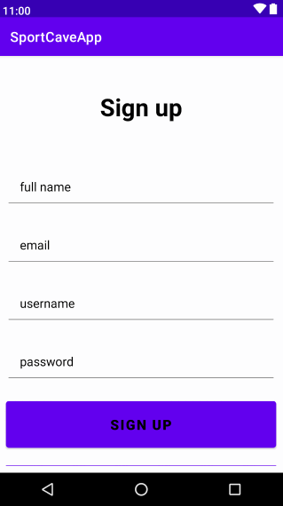
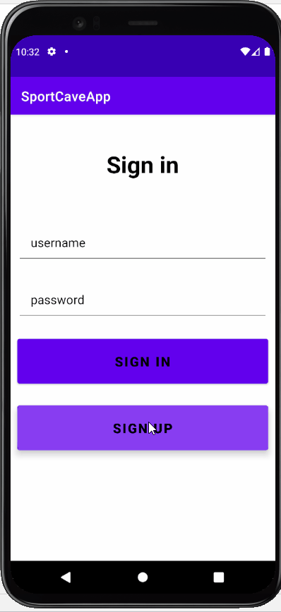
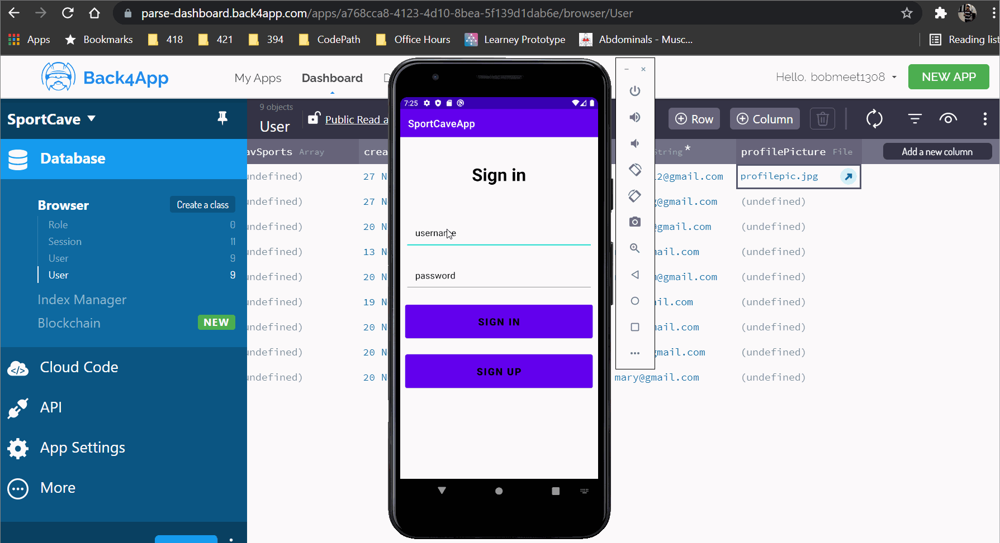
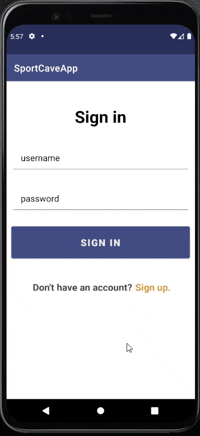

Original App Design Project - README Template
===

# SPORTCAVE

## Table of Contents
1. [Overview](#Overview)
1. [Product Spec](#Product-Spec)
1. [Wireframes](#Wireframes)
2. [Schema](#Schema)

## Overview
### Description
Browse sports categories to view scoring updates for domestic and international games. Connect with other sports fans.

### App Evaluation
- **Category:** Sports / Social
- **Mobile:** Easier to check for updates and post reactions on-the-go, use camera to post photos to reactions feed and update profile photo.
- **Story:** Allows users to view scoring updates for different sports in one location rather than scouring the Internet every time. Connect with fellow sports fans by sharing reactions.
- **Market:** Any sports fan would enjoy this app.
- **Habit:**  Users can check back as often as they'd like, multiple times a day
- **Scope:** Initial features are to view scoring updates and to share reactions with other fans. App can be expanded to include livestreaming links and include pull-to-refresh and search features.

## Product Spec

### 1. User Stories (Required and Optional)

**Required Must-have Stories**

* [x] User can create an account to access the app
* [x] User can log in if they already have an account
* [x] User can logout from the app
* [x] User can change pages from Sports -> Social -> Profile
* [x] User can update their profile information
* [x] User can use the smartphone camera to add a profile image
* [x] User can view the Social stream
* [x] User can post a reaction
* [x] User can select at least two sport and view the games and scores

**Optional Nice-to-have Stories**

* [ ] User can post photos to Social feed
* [ ] User can search the Social feed to reactions by #game
* [ ] User can click a reaction to view the user profile
* [ ] User cannot post a reaction unless hashtagged with a sport and a game
* [ ] User can pull to refresh for real-time Sports and Social data
* [ ] Create and update actions are changed in real-time
* [ ] User can click livestreaming link to watch the game
* [ ] User can favorite sports rather than manually entering them in the Profile
* [ ] User can view games and scores for more than two sports
* [ ] User can view a map to see games by location

### 2. Screen Archetypes

* Login
   * [x] User can log in if they already have an account
   * [x] User can click on "Sign Up" button to create an account
   - [x] Login UI

* Sign up
   * [x] User can create an account to access the app
   * [x] Sign up UI
   
* Sports
   * [x] User can select sports
   * [x] Sports UI

* Games / Scores
   * [x] User can view games and scores for the selected sport
   * [x] Games / Scores UI

* Social
    * [x] User can post their reaction of a game
    * [x] User can view reactions posted by other users
    * [x] Social UI

* Profile
   * [x] User can logout from the app
   * [x] User can update their profile information
   * [x] User can use the smartphone camera to add a profile image
   * [x] Profile UI

### 3. Navigation

**Tab Navigation** (Tab to Screen)

* Sports
* Social
* Profile

**Flow Navigation** (Screen to Screen)

* Login
  * Sports
* Login
  * Sign up
* Sign up
  * Login
* Sign up
  * Sports 
* Sports
  * Games
* Games
  * Sports
* Games
  * Scores
* Scores
  * Games

## Wireframes

Image URL : https://imgur.com/a/mM8O8yB

### [BONUS] Digital Wireframes & Mockups
URL: https://www.figma.com/file/9bkalDyIyTSFFvTYLGldzO/SportCave?node-id=0%3A1

### [BONUS] Interactive Prototype

URL : https://imgur.com/a/WWjdWS2

## Schema 
### Models
#### User

   | Property       | Type     | Description |
   | -------------  | -------- | ------------|
   | objectId       | String   | unique id for the user (default field) |
   | username       | String   | user account handle |
   | password       | String   | user account password |
   | email          | String   | user account email |
   | profileName    | String   | user profile name |
   | profilePicture | File     | user profile image |
   | favSports      | String   | user-entered favorite sports |
   
#### Reaction

   | Property     | Type     | Description |
   | -------------| -------- | ------------|
   | objectId     | String   | unique id for the comment (default field) |
   | user         | Pointer  | pointer to objectId (from User class) of user posting comment |
   | comment      | String   | comment text |
   | createdAt    | DateTime | date/time when post is created |

### Networking
* Games / Scores Page
  * (Read/GET): Query games and scores for selected sport from API
* Social Page
  * (Create/POST): Create a comment and post it to the Social stream
  * (Read/GET): Query all reactions from database
* Profile Page
  * (Read/GET) Query logged in User object
  * (Update/PUT) Update user profile attributes
 

## Sprint 1 (due 11/12)

 

## Sprint 2 (due 11/19)

 

## Sprint 3 (due 11/26)

 

## Updated GIF (12/17)

 

## Final Version of the SportCave App (12/19)

 

